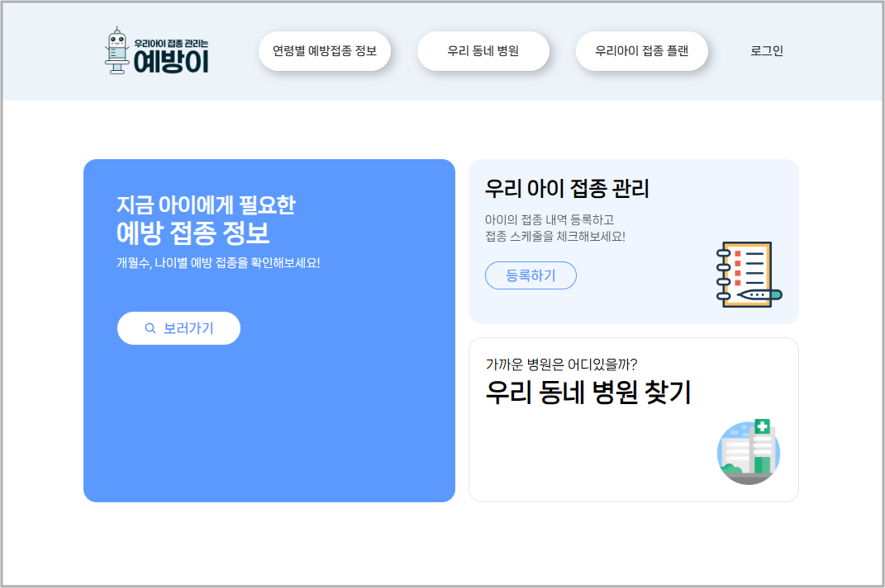
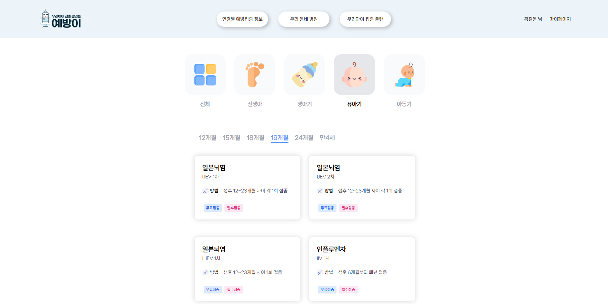
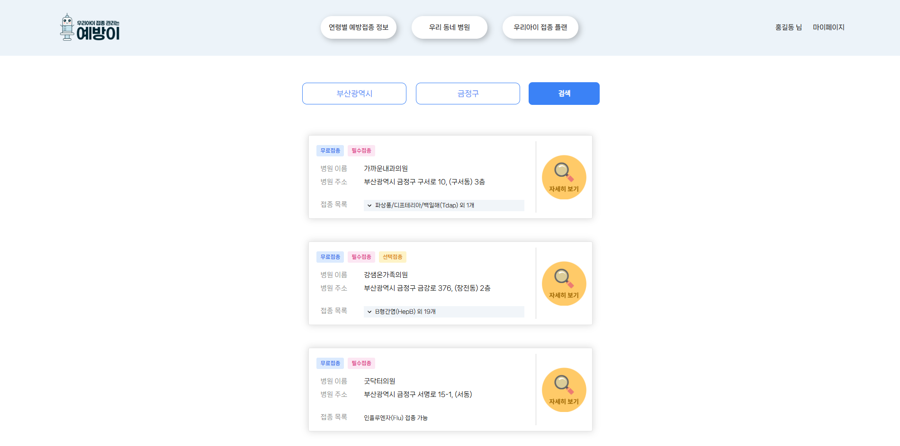
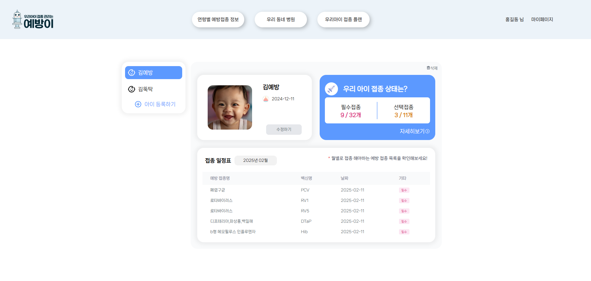
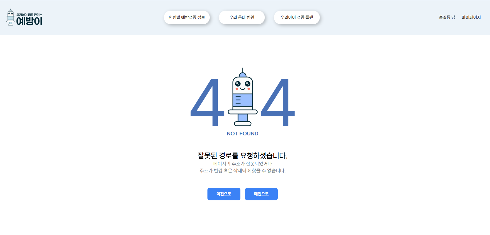
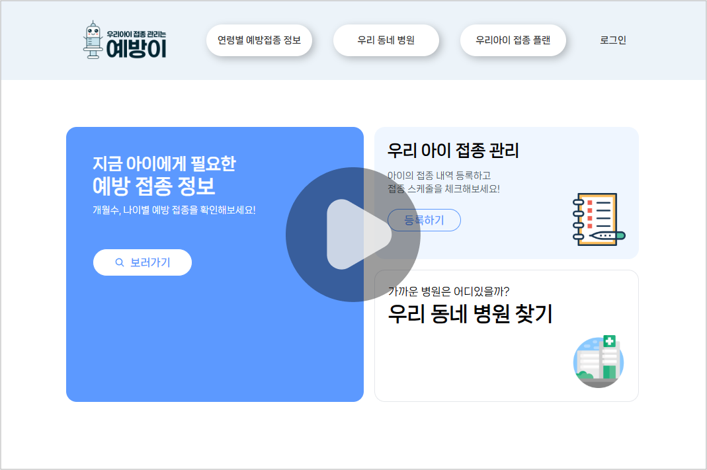

# 💉우리 아이 접종 관리, 예방이
[K-Digital 부산대 8회차] AI 활용 빅데이터분석 풀스택웹서비스 SW 개발자 양성과정 미니 프로젝트

- **주제:** 어린이 필수 예방 접종 안내 및 관리 시스템
- **목표:** 연령별 예방접종 정보, 우리 동네 병원 조회, 우리 아이 접종 플랜 및 
부모의 참여 유도를 통해 어린이들의 건강을 보호하고 전염병 예방

 

## 📈 개발 기간
> 2024.08.26 - 2024.10.02.

 

## 📝 활용 데이터 
- `질병관리청` 어린이 국가예방접종 지원사업 위탁의료기관 현황 정보
- `질병관리청` 표준예방접종일정표 (2024)
- `kAKAO MAP API`

 

## 👥 팀원 구성

|이름|담당|GITHUB|
|:------:|:---:|---|
|박래찬|BACK-END|https://github.com/chani1352|
|조은빈|FRONT-END|https://github.com/iambean-git|

 

## 🔧 개발 환경
- `FRONT-END:` React.js, HTML, CSS, JavaScript, Tailwind  
- `BACK-END:` Java, SpringBoot  
- `DB:` MySQL  
- `기타:` GITHUB, FIGMA, Notion  

 
 

## 📋 웹 서비스 주요 기능 요약
### 로그인 및 로그아웃
> - Email, PW 를 통한 사용자 인증 및 JWT 발급
> - Naver, Kakao, Google 등 OAuth를 이용한 소셜 로그인
> - 로그아웃 시 토큰 제거

 

### 회원가입
> - Email, PW, 이름, 연락처를 포함한 user 등록
> - 이메일 중복 여부 체크
> - 비밀번호 및 비밀번호 확인 동일 체크

 

### 연령별 예방접종
&nbsp;&nbsp;&nbsp;&nbsp;
> - 연령별, 개월수별 필수 예방 접종 정보 제공
> - 접종 시기와 방법 안내
> - 필수접종 / 선택접종 여부 안내

 

### 우리 동네 병원
&nbsp;&nbsp;&nbsp;&nbsp;
> - 시/도 및 시/군/구 선택 후 검색시 해당 지역의 접종 가능한 병원 리스트 안내
> - 병원 이름, 주소, 접종 가능한 백신 목록 제공
> - 자세히 보기를 통해 전화 번호 및 지도를 통한 위치 안내 (Kakao Map)

 

### 우리아이 접종 플랜
&nbsp;&nbsp;&nbsp;&nbsp;

- **접근 제한**
    > - 로그인 토큰을 통한 접근 제어 
    > - 인증되지 않은 사용자일 경우 로그인 페이지로 전환

- **자녀 등록 및 삭제**
    > - 자녀 이름, 생년월일로 자녀 등록 
    > - 자녀 등록시, 지난 접종 여부 체크 후 등록
- **접종 기록 관리**
    > - 필수/선택 접종 별로 접종 완료 한 백신 수 확인 가능
    > - 접종 여부 수정 가능
- **접종 스케쥴**
    > - 접종 여부를 반영하여 월별로 접종 해야하는 예방 접종 목록 확인

 

### 마이페이지
> - 내 정보 수정 가능 (이메일 변경 불가)
> - 로그아웃

 

### 기타

> - **404 에러 처리** : 잘못된 경로로 접속시, 오류 페이지 안내

 
 

## 💾 기록
[Notion LINK](https://bubble-pencil-c95.notion.site/KDT8_-_-15833b9601df81058596c8c3bdf39abc?pvs=4)
 
 
 

## 🎥 시연 영상

 
 

## 💡 느낀점

### 💁🏻‍♂ 박래찬
- **JPA를 활용한 데이터 관리 효율화**
 
Spring Boot에서 JPA를 활용하여 데이터베이스의 CRUD 작업을 효과적으로 처리하며 데이터 관리의 효율성과 유지보수성을 크게 향상시킬 수 있었습니다. 객체지향적인 데이터 처리 방식 덕분에 코드를 간결하고 직관적으로 유지할 수 있었으며, 데이터 관리가 훨씬 체계적으로 이루어졌습니다.

- **JWT를 이용한 인증 및 권한 관리**
 
JWT를 활용한 브라우저와 서버 간 인증을 학습하고 프로젝트에 적용하였습니다. 특히, JWT를 기반으로 필터 처리 메커니즘을 구현하며 요청의 인증 및 권한을 효율적으로 관리하는 방법을 익혔습니다. 이를 통해 안전하고 간편한 인증 시스템을 설계할 수 있었습니다.

- **디버깅 역량 강화의 필요성**
 
프로젝트 진행 중 디버깅 과정에서 부족함을 느꼈습니다. 복잡한 오류의 원인을 정확히 파악하고 효과적으로 해결하는 데 필요한 디버깅 기술과 도구 활용 능력을 보완해야 함을 깨달았습니다. 이를 통해 문제 해결 속도와 품질을 더욱 높이고자 합니다.

- **어노테이션 활용 능력 개선**
 
어노테이션 및 관련 기술에 대한 이해 부족으로 일부 기능을 적절히 활용하지 못한 사례가 있었습니다. 이러한 경험을 통해 어노테이션의 동작 원리와 사용 방법에 대해 추가 학습이  필요하다고 느꼈습니다. 이를 통해 Spring Boot의 다양한 기능을 더 효과적으로 사용할 수 있는 역량을 키울 계획입니다.

### 💁🏻‍♀ 조은빈
- **백엔드와의 효율적인 통신**
 
fetch와 axios를 활용하여 백엔드와의 통신 방식을 명확히 이해하게 되었습니다. REST API를 통해 데이터를 주고받으며, 요청과 응답의 처리 및 에러 핸들링의 중요성을 깊이 체감했습니다. 이를 통해 백엔드와 원활히 협력하며 데이터를 효과적으로 관리할 수 있었습니다.

- **UI 컴포넌트의 커스터마이징**
 
Select Box와 Check Box 같은 기본 UI 요소를 프로젝트의 요구사항에 맞게 커스터마이징하는 방법을 익혔습니다. 클릭 이벤트 및 다양한 디자인 요소를 활용하여 사용자 경험(UX)을 개선할 수 있는 창의적인 방법을 찾고 구현하는 과정이 흥미로웠습니다.

- **파일 전송 및 서버와의 연동**
 
String 또는 JSON 형식의 데이터 전송뿐만 아니라, 파일(이미지) 업로드와 서버 및 데이터베이스 저장 과정을 학습했습니다.

- **라우팅과 동적 페이지 구현**
 
Router를 사용해 페이지 이동과 URL 파라미터를 활용하여 동적 페이지를 구현할 수 있게 되었습니다. 특히, URL을 기반으로 데이터를 받아오고 렌더링하며 SPA(Single Page Application)의 장점을 극대화하는 방법을 터득했습니다.

- **이전 위치 기반 동적 페이지 전환 학습 필요**
 
특정 이벤트 실행 후, 이전 위치에 따라 다음 페이지를 동적으로 설정하는 방법에 대해 추가적인 학습이 필요합니다. 이를 위해 상태(State)를 효과적으로 저장하고 전달하는 방법을 연습하며, 보다 유연한 페이지 전환 로직을 구현하고자 합니다.

